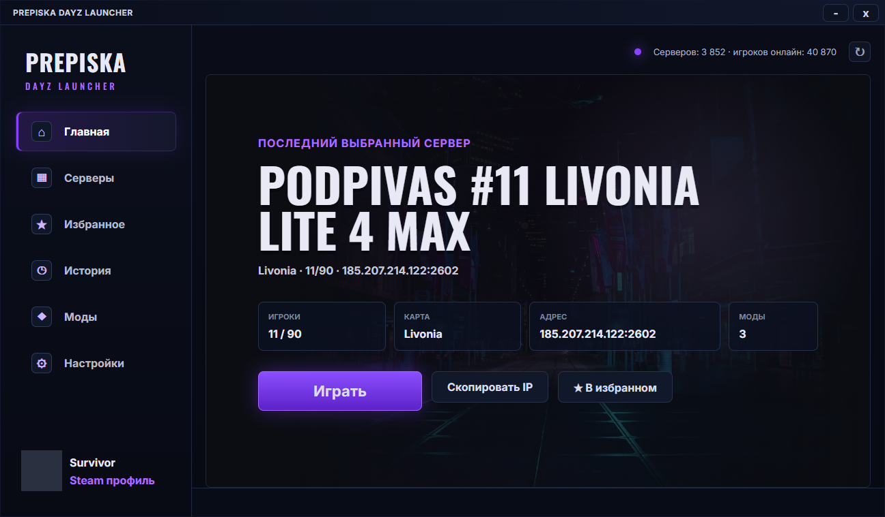
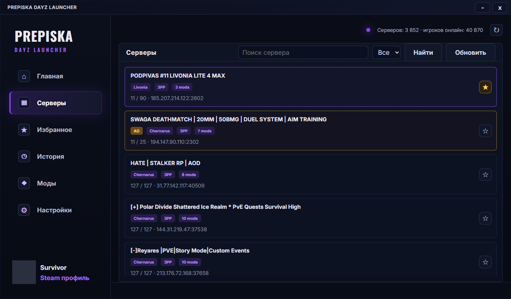
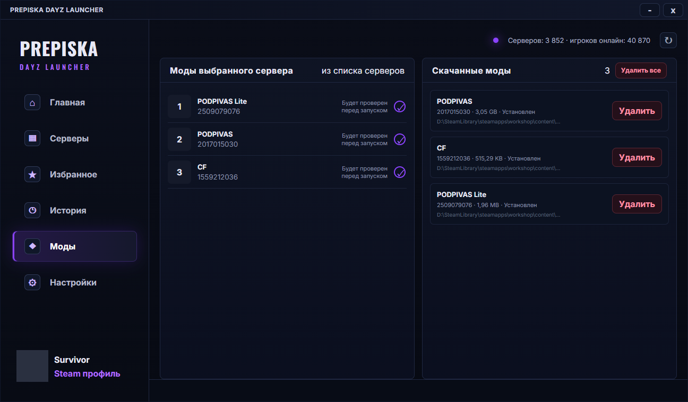
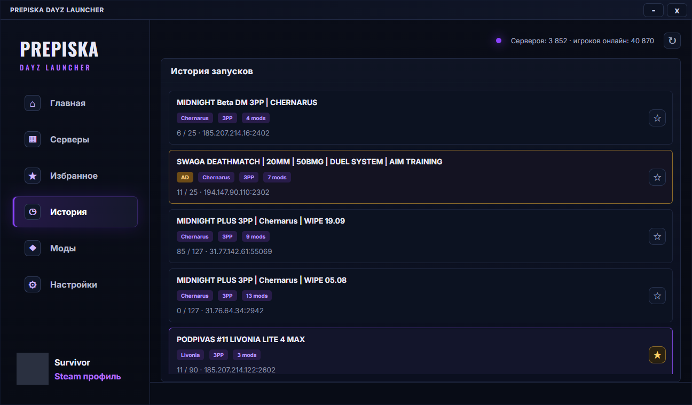
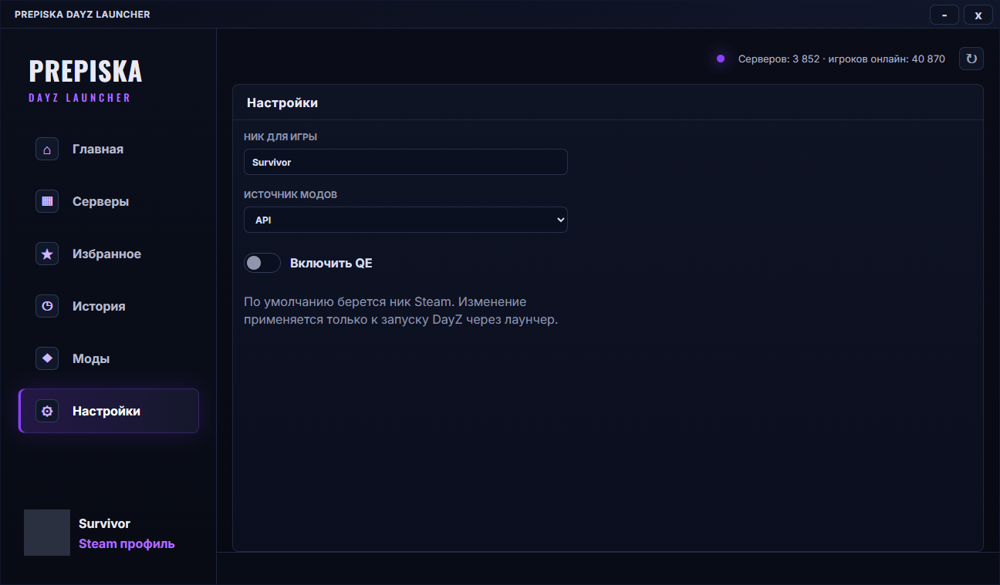
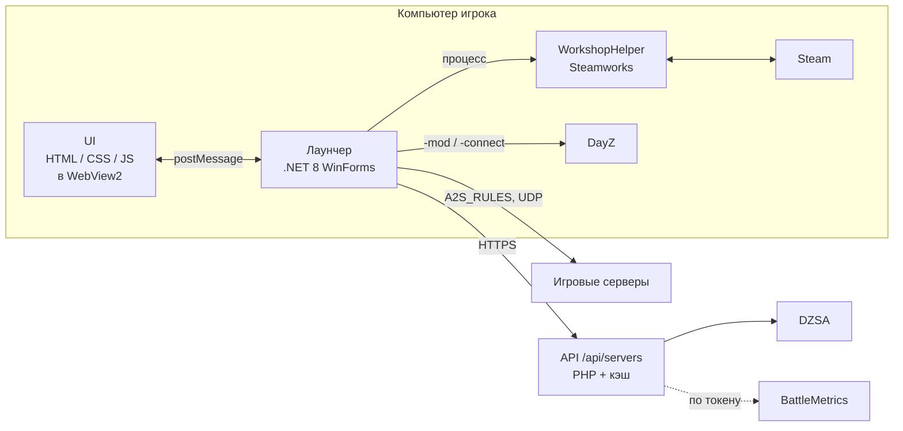

<div align="center">

# PREPISKA DayZ Launcher

**Лаунчер DayZ для Windows: все серверы в одном списке, моды скачиваются сами, вход на сервер — одной кнопкой.**




</div>

## Возможности

- **Все серверы DayZ сразу** — весь список DZSA (более 20 000 серверов, пустые дольше 30 минут скрываются) с поиском по названию и адресу, устойчивым к опечаткам. Спонсорские серверы закреплены сверху.
- **Моды без ручной работы** — перед запуском лаунчер проверяет моды сервера, подписывается на недостающие в Steam Workshop и ждёт окончания загрузки.
- **Точный список модов** — если API не знает моды сервера, лаунчер спрашивает их у самого сервера по протоколу A2S.
- **Правильный порядок модов** — базовые моды (CF, фреймворки) загружаются раньше зависимых.
- **Избранное и история** — последние 50 серверов, на которые вы заходили.
- **Управление скачанными модами** — размер, статус, обновление и удаление (по одному или всех сразу).
- **Ник из Steam** — подставляется автоматически, его можно поменять в настройках.
- **Наклоны на Q/E** — переключатель в настройках правит пресет управления DayZ.

## Скриншоты

| Серверы | Моды |
|:---:|:---:|
|  |  |
| **История запусков** | **Настройки** |
|  |  |

## Установка для игроков

1. Установите [.NET 8 Desktop Runtime (x64)](https://dotnet.microsoft.com/download/dotnet/8.0) и, если его нет, [WebView2 Runtime](https://developer.microsoft.com/microsoft-edge/webview2/) (в Windows 11 уже есть).
2. Распакуйте архив с лаунчером в любую папку и запустите `PREPISKA DayZ Launcher.exe`.
3. Steam должен быть запущен, а DayZ — установлен.

## Как это устроено



- **Лаунчер** — окно WinForms с WebView2. Интерфейс написан на обычных HTML/CSS/JS и обменивается с приложением сообщениями.
- **WorkshopHelper** — отдельный консольный процесс, через Steamworks подписывается на моды и узнаёт их статус. Отдельный процесс нужен, чтобы Steam не оставался инициализированным внутри лаунчера и не мешал загрузке модов.
- **API** (`server/api/servers.php`) — собирает и нормализует список серверов и кэширует его. Лаунчер хранит копию списка у себя и обновляет её в фоне раз в 5 минут (ответ сжимается gzip).

## Сборка

Нужны Windows и [.NET 8 SDK](https://dotnet.microsoft.com/download).

```powershell
# Сборка
dotnet build PrepiskaLauncher.sln -c Release

# Готовая папка для распространения
dotnet publish src/PrepiskaLauncher/PrepiskaLauncher.csproj -c Release -o publish
```

WorkshopHelper собирается вместе с лаунчером и кладётся рядом с его exe. В `publish/` окажется всё необходимое. Проект также открывается в Visual Studio 2022 через `PrepiskaLauncher.sln`.

### Тесты и CI

```powershell
dotnet test PrepiskaLauncher.sln
```

Тесты покрывают поиск серверов, разбор JSON из API, разбор ответа A2S и вспомогательные функции. GitHub Actions (`.github/workflows/build.yml`) на каждый push запускает тесты, собирает готовую папку лаунчера в артефакт и проверяет синтаксис PHP.

Чтобы Windows SmartScreen не предупреждал о «неизвестном издателе», exe нужно подписать сертификатом подписи кода. Добавьте в Secrets репозитория `SIGNING_CERT_BASE64` (`.pfx` в base64) и `SIGNING_CERT_PASSWORD` — CI подпишет сборку автоматически.

## Структура репозитория

```
src/
  PrepiskaLauncher/          Лаунчер (.NET 8, WinForms + WebView2)
    MainForm.cs              Окно: команды из UI → сервисы → состояние обратно в UI
    Bridge/                  Протокол обмена с UI (сообщения и DTO)
    Core/                    Настройки, пути, лог, утилиты
    Models/                  Модели данных
    Services/Servers/        Список серверов: загрузка, кэш, поиск
    Services/Mods/           Подготовка модов к запуску, скачанные моды
    Services/*.cs            Steam, Workshop, запуск игры, A2S, пресет Q/E
    Ui/                      index.html, styles.css, app.js
  WorkshopHelper/            Консольный процесс для Steamworks
server/
  api/servers.php            API списка серверов
  config.example.php         Шаблон локальных настроек API
  dev-router.php             Роутер для локального запуска API
tests/
  PrepiskaLauncher.Tests/    Тесты (xUnit)
docs/screenshots/            Скриншоты для README
.github/workflows/            CI: тесты, сборка, проверка PHP
```

## Настройка

### Лаунчер

| Переменная окружения | Назначение |
|---|---|
| `PREPISKA_SERVERS_API_URL` | Адрес API списка серверов. По умолчанию `https://dayz.goidacord.ru/api/servers` |
| `DAYZ_PATH` | Папка DayZ, если она не нашлась автоматически |
| `WORKSHOP_HELPER_PATH` | Путь к `WorkshopHelper.exe`, если он лежит не рядом с лаунчером |

Данные пользователя хранятся в `%AppData%\PREPISKA DayZ Launcher Native\`: там лежат настройки, кэш списка серверов и `debug.log` для диагностики.

### API

Нужен PHP 8.0+ с расширениями `curl` и `mbstring`. Адрес `/api/servers` должен вести на `server/api/servers.php`, а у PHP должны быть права на запись в `server/cache/`.

- **Спонсорские серверы** задаются в `$sponsorEndpoints` / `$sponsorIps` в начале `servers.php`.
- **Фильтр «зеркал»** (подменных копий популярных серверов) и **короткие имена серверов** — `$mirrorSubnets` и `$displayNamePrefixes` там же.
- **Локальные настройки** — скопируйте `server/config.example.php` в `server/config.local.php` (файл не хранится в git):
  - `battlemetrics_token` — токен BattleMetrics от аккаунта с подпиской; без него BattleMetrics пропускается;
  - `refresh_key` — ключ для принудительного обновления кэша (`/api/servers?refresh=1&key=...`); без ключа обновить кэш по запросу нельзя, он обновляется сам раз в минуту.

Локальный запуск API:

```powershell
php -S 127.0.0.1:8088 server/dev-router.php
$env:PREPISKA_SERVERS_API_URL = "http://127.0.0.1:8088/api/servers"
dotnet run --project src/PrepiskaLauncher
```

## Лицензия

Проприетарная, все права защищены — см. [LICENSE](LICENSE). Там же перечислены лицензии сторонних компонентов: шрифты Inter и Oswald (OFL), фон главного экрана (Unsplash License), Facepunch.Steamworks (MIT).
