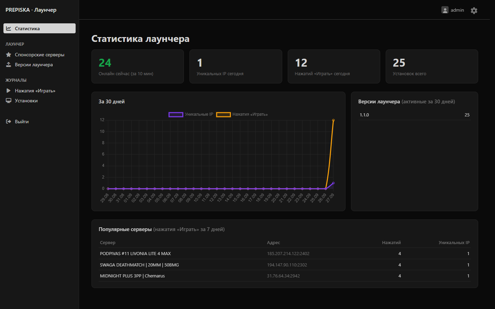
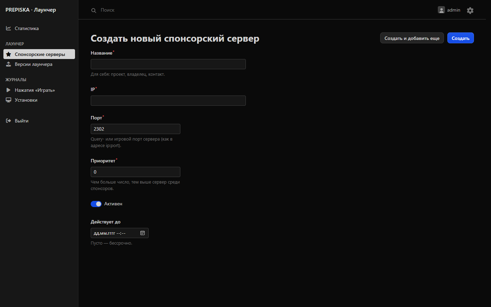
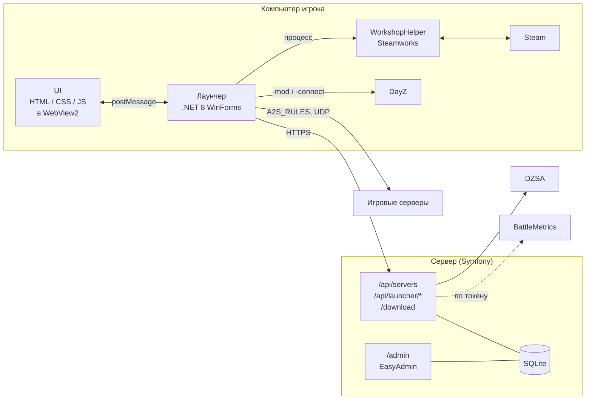

<div align="center">

# PREPISKA DayZ Launcher

**Лаунчер DayZ для Windows: все серверы с модами вместо рекламных, моды скачиваются из Steam Workshop сами.**


</div>

## Возможности

**Лаунчер**

- **Все серверы с модами** — в стандартном лаунчере DayZ список забит рекламными серверами, а серверов с модами в нём мало. Здесь весь каталог DZSA (около 90 % серверов в нём с модами), отсортированный по онлайну: рекламные места DZSA не учитываются, пустые дольше 30 минут серверы и подделки-«зеркала» скрыты. Поиск по названию и адресу устойчив к опечаткам. Сверху — только спонсоры, заданные в админке.
- **Моды без ручной работы** — перед запуском лаунчер проверяет моды сервера, подписывается на недостающие в Steam Workshop и ждёт окончания загрузки.
- **Точный список модов** — если API не знает моды сервера, лаунчер спрашивает их у самого сервера по протоколу A2S.
- **Правильный порядок модов** — базовые моды (CF, фреймворки) загружаются раньше зависимых.
- **Автообновление** — лаунчер сам находит новую версию, скачивает установщик, проверяет контрольную сумму и перезапускается уже обновлённым.
- **Бег в наклоне на Q/E** — лаунчер назначает на Q/E наклоны из раскладки геймпада (`UALeanLeftGamepad` / `UALeanRightGamepad` в пресетах управления DayZ). С ними можно бежать, не выходя из наклона: модель смещается в сторону, и противнику труднее попасть. Включается и выключается галочкой в настройках.
- **Избранное и история**, **управление скачанными модами**, **ник из Steam**.

**Сайт** — лендинг на `/` с кнопкой скачивания последней версии, живой статистикой серверов и игроков, скриншотами и ответами на частые вопросы.

**Админка** (`/admin`)

- **Спонсорские серверы** — закрепить сервер наверху списка, задать приоритет и срок размещения. Изменения сразу видны в лаунчерах.
- **Статистика** — сколько лаунчеров онлайн прямо сейчас, сколько уникальных IP пользовались лаунчером за день, нажатия «Играть» и самые популярные серверы, версии лаунчеров.
- **Версии лаунчера** — загрузил установщик новой версии, и все лаунчеры предложат обновиться.

## Скриншоты

| Серверы | Моды |
|:---:|:---:|
|  |  |
| **История запусков** | **Настройки** |
|  |  |
| **Админка: статистика** | **Админка: спонсорский сервер** |
|  |  |

## Установка для игроков

1. Скачайте установщик `PREPISKA-DayZ-Launcher-Setup-x.y.z.exe` из раздела [Releases](../../releases/latest) (или по постоянной ссылке `https://<домен>/download`) и запустите его.
2. Права администратора не нужны: лаунчер ставится в профиль пользователя. Если на компьютере нет .NET 8 Desktop Runtime или WebView2 Runtime, установщик сам скачает их с сайта Microsoft.
3. Для работы нужен запущенный Steam и установленная DayZ.

Дальше лаунчер обновляется сам. Удаляется через «Параметры → Приложения»; настройки и кэш остаются в `%AppData%\PREPISKA DayZ Launcher Native\`.

## Как это устроено



- **Лаунчер** — окно WinForms с WebView2. Интерфейс написан на обычных HTML/CSS/JS и обменивается с приложением сообщениями.
- **WorkshopHelper** — отдельный консольный процесс, через Steamworks подписывается на моды и узнаёт их статус. Отдельный процесс нужен, чтобы Steam не оставался инициализированным внутри лаунчера и не мешал загрузке модов.
- **Сервер** (`server/`, Symfony 7.4) — собирает и нормализует список серверов (cron раз в минуту), помечает спонсоров, принимает статистику от лаунчеров, раздаёт обновления; админка на EasyAdmin. Готовый ответ для лаунчеров собирается заранее и отдаётся файлом, поэтому запрос почти ничего не стоит серверу.

## Сборка

### Лаунчер

Нужны Windows и [.NET 8 SDK](https://dotnet.microsoft.com/download).

```powershell
dotnet build PrepiskaLauncher.sln -c Release
dotnet test PrepiskaLauncher.sln
dotnet publish src/PrepiskaLauncher/PrepiskaLauncher.csproj -c Release -o publish   # готовая папка
```

WorkshopHelper собирается вместе с лаунчером и кладётся рядом с его exe. Проект также открывается в Visual Studio 2022 через `PrepiskaLauncher.sln`.

### Установщик и релизы

Установщик собирается [Inno Setup](https://jrsoftware.org/isinfo.php) по скрипту `installer/PrepiskaLauncher.iss`:

```powershell
dotnet publish src/PrepiskaLauncher/PrepiskaLauncher.csproj -c Release -o publish -p:Version=1.2.3
ISCC installer/PrepiskaLauncher.iss /DAppVersion=1.2.3   # → artifacts/PREPISKA-DayZ-Launcher-Setup-1.2.3.exe
```

Выпуск новой версии:

1. `git tag v1.2.3 && git push origin v1.2.3` — GitHub Actions (`.github/workflows/release.yml`) прогонит тесты, соберёт установщик и опубликует его в Releases.
2. Скачайте установщик из релиза и загрузите его в админке: **Версии лаунчера → Добавить**. После этого лаунчеры предложат обновиться.

Чтобы Windows SmartScreen не предупреждал о «неизвестном издателе», exe нужно подписать сертификатом подписи кода. Добавьте в Secrets репозитория `SIGNING_CERT_BASE64` (`.pfx` в base64) и `SIGNING_CERT_PASSWORD` — релизный workflow подпишет exe и установщик автоматически (`installer/sign.ps1`).

### Сервер

Нужны PHP 8.2+ (расширения `pdo_sqlite`, `intl`, `mbstring`, `curl`) и [Composer](https://getcomposer.org).

```powershell
cd server
composer install
php bin/console doctrine:migrations:migrate
php bin/console app:admin:create admin          # создаст админа и выведет пароль
php bin/console app:servers:refresh             # первая загрузка списка серверов
php vendor/bin/phpunit                          # тесты

# Локальный запуск (dev-router.php нужен встроенному серверу PHP вместо nginx)
php -S 127.0.0.1:8090 -t public dev-router.php
```

Лаунчер к локальному серверу: `$env:PREPISKA_API_URL = "http://127.0.0.1:8090"; dotnet run --project src/PrepiskaLauncher`.

## Развёртывание сервера

1. Код: `git clone` в `/var/www/dayz-launcher`, затем в `server/`:
   ```bash
   composer install --no-dev --optimize-autoloader
   php bin/console doctrine:migrations:migrate --no-interaction
   php bin/console app:admin:create admin
   ```
   `server/var/` должен принадлежать пользователю PHP-FPM (`www-data`) — там база, кэш, снимок списка серверов и установщики.
2. `server/.env.local` (в git не хранится):
   ```ini
   APP_ENV=prod
   APP_SECRET=<случайная строка>
   BATTLEMETRICS_TOKEN=        # токен BattleMetrics (нужна подписка); пусто — источник пропускается
   SERVERS_REFRESH_KEY=        # ключ для /api/servers?refresh=1&key=...; пусто — отключено
   STATS_RETENTION_DAYS=180    # сколько дней хранить статистику по IP
   ```
3. nginx: `root …/server/public;`, `try_files $uri /index.php$is_args$args;`, `client_max_body_size 64m;` (загрузка установщиков), gzip для `application/json`.
4. cron от `www-data`:
   ```cron
   * * * * *  php /var/www/dayz-launcher/server/bin/console app:servers:refresh --env=prod
   30 4 * * * php /var/www/dayz-launcher/server/bin/console app:stats:prune --env=prod
   ```

### HTTP API

| Метод | Адрес | Назначение |
|---|---|---|
| GET | `/api/servers` | Список серверов (`search`, `name`, `limit` — необязательно) |
| POST | `/api/launcher/events` | Событие лаунчера: `start`, `heartbeat`, `play` (заголовок `x-launcher-guid`) |
| GET | `/api/launcher/update?version=1.2.3` | Есть ли версия новее: ссылка, SHA-256, список изменений |
| GET | `/` | Лендинг |
| GET | `/download`, `/download/{version}` | Установщик последней / указанной версии |

## Настройка лаунчера

| Переменная окружения | Назначение |
|---|---|
| `PREPISKA_API_URL` | Адрес сервера. По умолчанию `https://dayz.goidacord.ru` |
| `DAYZ_PATH` | Папка DayZ, если она не нашлась автоматически |
| `WORKSHOP_HELPER_PATH` | Путь к `WorkshopHelper.exe`, если он лежит не рядом с лаунчером |

Лаунчер отправляет на сервер анонимный ID установки (случайный GUID), версию и события `start` / `heartbeat` / `play`; IP-адрес сервер видит из соединения. Данные пользователя хранятся в `%AppData%\PREPISKA DayZ Launcher Native\` (настройки, кэш, `debug.log`).

## Структура репозитория

```
src/
  PrepiskaLauncher/          Лаунчер (.NET 8, WinForms + WebView2)
    MainForm.cs              Окно: команды из UI → сервисы → состояние обратно в UI
    Bridge/                  Протокол обмена с UI (сообщения и DTO)
    Core/                    Настройки, пути, лог, утилиты
    Models/                  Модели данных
    Services/Backend/        Клиент сервера: статистика, обновления
    Services/Servers/        Список серверов: загрузка, кэш, поиск
    Services/Mods/           Подготовка модов к запуску, скачанные моды
    Services/*.cs            Steam, Workshop, запуск игры, A2S, пресет Q/E
    Ui/                      index.html, styles.css, app.js
  WorkshopHelper/            Консольный процесс для Steamworks
server/                      Сервер (Symfony 7.4)
  src/ServerList/            Сбор, нормализация, кэш и выдача списка серверов
  src/Stats/                 События лаунчеров и статистика
  src/Release/               Хранилище установщиков
  src/Controller/            Лендинг, API, скачивание, админка (EasyAdmin)
  templates/landing/         Лендинг (Twig), стили и картинки — public/landing/
  src/Command/               app:servers:refresh, app:stats:prune, app:admin:create
  tests/                     PHPUnit
tests/
  PrepiskaLauncher.Tests/    Тесты лаунчера (xUnit)
installer/                   Установщик (Inno Setup) и скрипт подписи
docs/screenshots/            Скриншоты для README
.github/workflows/           CI: тесты лаунчера и сервера, сборка, релизы
```

## Лицензия

Проприетарная, все права защищены — см. [LICENSE](LICENSE). Там же перечислены лицензии сторонних компонентов: шрифты Inter и Oswald (OFL), фон главного экрана (Unsplash License), Facepunch.Steamworks (MIT), Chart.js (MIT).
